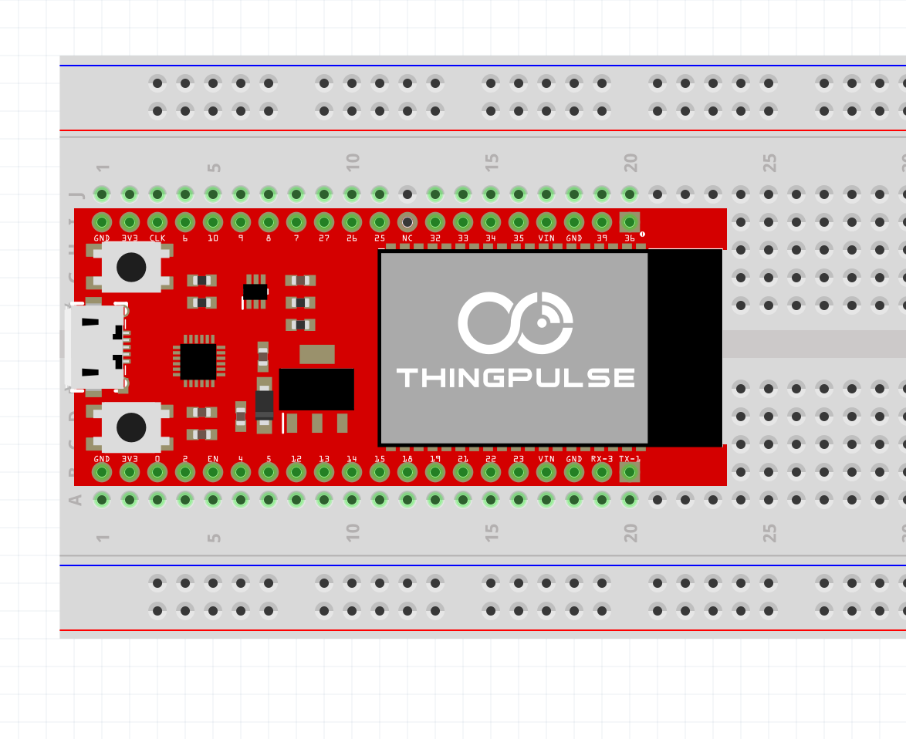

# fritzing-parts
Fritzing parts for ThingPulse devices

This repository contains part libraries of ThingPulse devices which can be used with the Fritzing Application.

# Supported Parts

parts/thingpulse-esp32-epulse-dev-board.fzpz: [Shop](https://thingpulse.com/product/epulse-thingpulse-esp32-devboard/)
